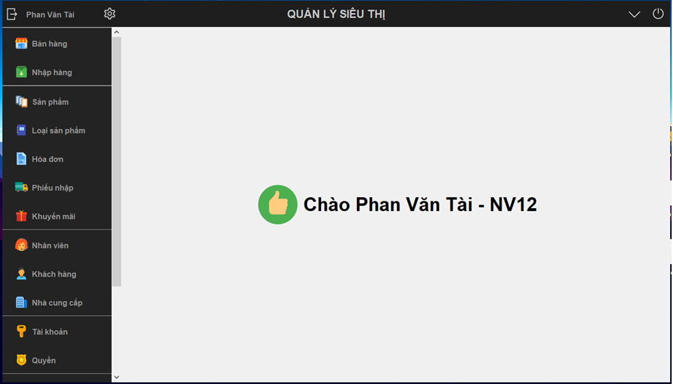

# ĐỒ ÁN JAVA - QUẢN LÝ ĐIỆN THOẠI

### *THÀNH VIÊN NHÓM*:

Stt | Mã sinh viên | Tên
---- | ---- | ---
1 | 3118410161 | Trần Quốc Huy
2 | 3118410393 | Hồ Nguyên Thành
3 | 3118410387 | Nguyễn Văn Thành
4 | 3118410098 | Nguyễn Thị Hương Giang
5 | 3118410320 | Đặng Thị Kiều Oanh

### *HƯỚNG DẪN, CÀI ĐẶT VÀ CHẠY THỬ*:

Các bạn vui lòng tải về và xem file `Tổng quan về đồ án.docx` hoặc `Tổng quan về đồ án.doc` nếu không xem được `.docx`

[VIDEO hướng dẫn](https://www.loom.com/share/4993ded95b9f4a1abc8af7704516057b)

### *SCREENSHOTS:*

 
<!--stackedit_data:
eyJoaXN0b3J5IjpbODU0NzMwMzE3LDE4MjgyMjM5NjMsLTQ2Nj
g0MjA2LC0zODY5MDg0OTEsLTMwNjYyNzNdfQ==
-->
